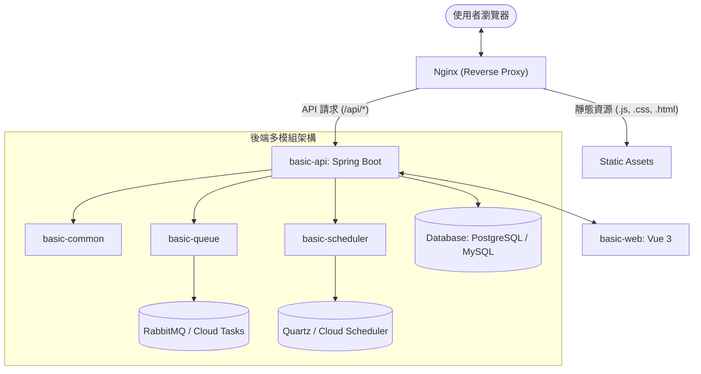
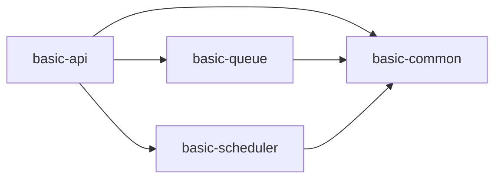

# 系統架構說明 (System Architecture)

本文件說明專案的整體技術架構、模組化設計以及組件間交互邏輯。

## 1. 架構概覽 (Architectural Overview)

本專案採用 **前後端分離 (Decoupled Frontend/Backend)** 模式，後端使用 **Maven 多模組 (Multi-module)** 架構，並針對雲端與地端環境提供了抽象層實作。

### 系統組件圖

## 2. 邊緣節點 (Edge Component - Nginx)

Nginx 作為系統的入口點 (Entry Point)，承擔以下職責：
- **反向代理 (Reverse Proxy)**：根據 URL 路徑將請求分流至前端靜態資源或後端 API。
- **解決跨域問題**：透過統一入口避免瀏覽器同源政策 (CORS) 限制。
- **靜態資源優化**：提供瀏覽器快取設定與 gzip 壓縮。

---

## 3. 後端模組解構 (Backend Modules)

後端依功能職責劃分為四個主要模組：

| 模組名稱 | 職責說明 | 核心技術 |
| :--- | :--- | :--- |
| **basic-common** | 基礎設施與通用定義 | JPA, Lombok, Jackson |
| **basic-api** | 業務邏輯與 RESTful 入口 | Spring Data JPA, Spring Security |
| **basic-queue** | 非同步訊息處理抽象層 | RabbitMQ, Cloud Tasks |
| **basic-scheduler** | 排程任務管理抽象層 | Spring Quartz, Cloud Scheduler |

### 模組相依關係

## 3. 關鍵技術設計 (Key Design Patterns)

### 3.1 跨環境抽象 (Environment Abstraction)
透過 Spring `@Profile` 機制，系統可在不修改程式碼的情況下切換本地與雲端實作：

- **訊息佇列 (Queue)**:
    - `local`: 使用 RabbitMQ 進行訊息分發。
    - `cloud`: 使用 GCP Cloud Tasks 進行任務投遞。
- **排程管理 (Scheduler)**:
    - `local`: 使用 Spring Quartz 搭配資料庫進行任務調度。
    - `cloud`: 使用 GCP Cloud Scheduler 觸發 HTTP 端點。

### 3.2 資料映射 (Data Mapping)
使用 **MapStruct** 處理 Entity 與 DTO 之間的轉換，確保轉換邏輯在編譯期生成，兼顧性能與安全。

## 4. 前端架構 (Frontend Architecture)

前端由 **Vite** 驅動，採用 **Vue 3 (Composition API)** 開發，並使用單向數據流管理狀態。

- **狀態管理**: Pinia
- **路由管理**: Vue Router
- **網路通訊**: Axios (整合統一攔截器處理錯誤與權限)

---
詳細模組說明請參閱：[模組說明首頁](MODULES/README.md)
