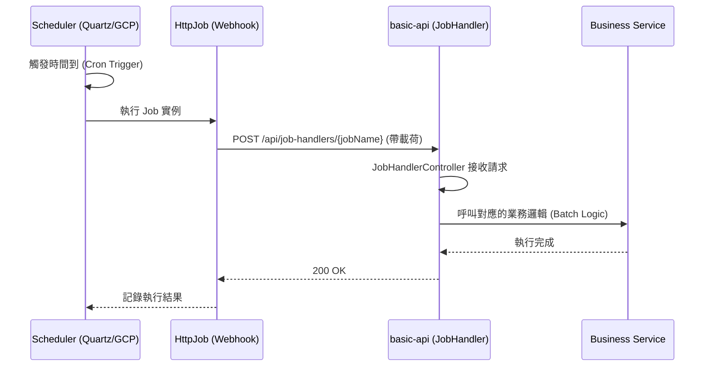
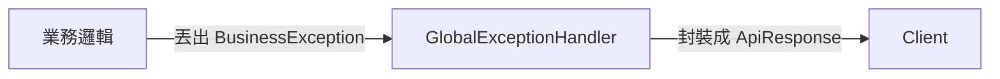

# 業務流程指引 (Business Flow Guide)

本文件說明系統中常見的一般性業務流程，協助開發者理解功能如何在各模組間串接。

## 1. 排程任務生命週期 (Scheduler Life Cycle)

系統採用 **Webhook 觸發模式**。排程器（Quartz 或 Cloud Scheduler）不直接執行業務代碼，而是透過發送 HTTP 請求來觸發後端 API。

### 1.1 如何設定排程 (How to set scheduler)

當使用者透過 API 或管理介面建立排程時，流程如下：

1.  **用戶端傳送請求**: 透過 `POST /api/jobs` 傳送 `CreateJobReq`（包含 JobName, Cron, Payload）。
2.  **API 接收與轉發**: `JobController` 呼叫 `SchedulerService.createJob`。
3.  **抽象層分流**:
    -   **本地 (local profile)**: `QuartzSchedulerService` 在資料庫中建立 `HttpJob`。
    -   **雲端 (cloudrun profile)**: `CloudSchedulerService` 呼叫 GCP API 建立 Cloud Scheduler 任務。
4.  **註冊回呼 URL**: 建立任務時，系統會自動拼湊回呼地址：`${job-handler-url}/api/job-handlers/{jobName}`。

### 1.2 排程如何啟動批次 (How scheduler starts a batch)

當達到設定的 Cron 時間時，觸發流程如下：



1.  **觸發任務**: 排程器引擎喚醒任務。
2.  **執行 Webhook**: `HttpJob` 發送一個封裝好的 HTTP 請求至 `basic-api`。
3.  **接收回呼**: `JobHandlerController` 擷取 Payload。
4.  **啟動批次**: 在 Controller 內部呼叫對應的 Service 執行數據處理、發送報表等批次作業。

## 2. 訊息非同步處理 (Async Message Processing)

系統透過 `QueueService` 提供統一的訊息傳送介面，並根據環境切換實作。

### 2.1 訊息發送流程

1.  **呼叫服務**: 業務邏輯呼叫 `QueueService.sendMessage` 或 `sendDelayedMessage`。
2.  **實作分流**:
    -   **本地 (local profile)**: `RabbitMqQueueService` 使用 `RabbitTemplate` 將訊息發送到指定 Queue。
    -   **雲端 (cloudrun profile)**: `CloudTaskQueueService` 呼叫 GCP Cloud Tasks API 建立一個 Task。
3.  **非同步執行**:
    -   **RabbitMQ**: 消費者（或外部 Webhook）接收訊息並處理。
    -   **Cloud Tasks**: GCP 在預定時間呼叫設定好的回呼 URL（Webhook）。

### 2.2 特性
-   **延遲訊息**: 支援設定 `delaySeconds`，適用於「X 分鐘後執行任務」的場景。
-   **抽象化**: 業務開發者不需要關心底層是用 RabbitMQ 還是 Cloud Tasks。

---

## 3. 全域錯誤處理 (Global Error Handling)

為了確保 API 回傳格式的一致性，系統建立了統一的例外處理機制。

### 3.1 錯誤處理流程



1.  **丟出例外**: 業務邏輯中遇到不合規況（如：查無資料、權限不足）時，主動丟出 `BusinessException`。
    -   範例：`throw new BusinessException(ResultCode.NOT_FOUND);`
2.  **攔截與封裝**: `GlobalExceptionHandler` 捕捉到例外，從 `ResultCode` 中提取錯誤碼與訊息。
3.  **統一口述**: 最終回傳一個帶有非 200 `code` 的 JSON 回應，格式如下：
    ```json
    {
      "code": 404,
      "message": "Not Found"
    }
    ```

### 3.2 自定義錯誤碼
開發者應優先使用 `ResultCode` 中定義的列舉值，確保全系統錯誤訊息的一致性。
