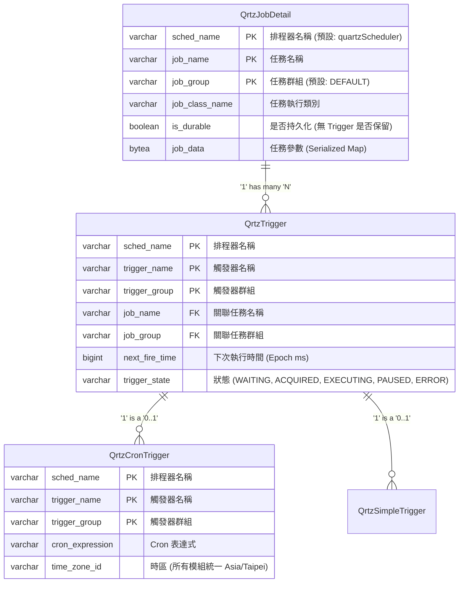

# Quartz 排程模組說明

本文件詳細說明 Quartz 在系統中的資料庫結構與 Entity 映射。

## 資料表結構 (Schema)

Quartz 使用 11 張標準資料表來儲存排程資訊，主要使用的有：

*   `qrtz_job_details`: 儲存任務定義 (JobDetail)
*   `qrtz_triggers`: 儲存觸發器基本資訊 (Trigger)
*   `qrtz_cron_triggers`: 儲存 Cron 表達式 (CronTrigger)

### 實體關係圖 (ER Model)

## JPA Entity 說明

位於 `org.inariforge.scheduler.entity.quartz` 套件。

> **注意**：所有 Quartz Entity 皆標註 `@Immutable`，僅供查詢使用，禁止透過 JPA 修改。請一律透過 `SchedulerService` 操作排程。

### 1. QrtzJobDetail
任務定義檔。對應 `qrtz_job_details` 表。

### 2. QrtzTrigger
觸發器基礎資訊。對應 `qrtz_triggers` 表。
*   `triggerState` 欄位可查詢任務目前狀態 (e.g. `PAUSED`, `WAITING`)。

### 3. QrtzCronTrigger
Cron 觸發器專用資訊。對應 `qrtz_cron_triggers` 表。
*   可查詢 `cronExpression`。
