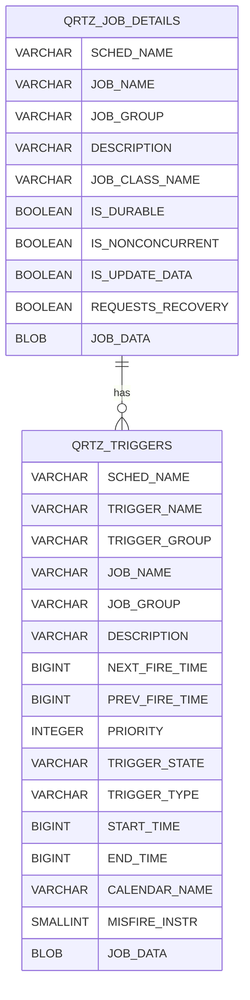

# Quartz 核心任務與觸發器

本文件說明 Quartz 的核心資料表：QRTZ_JOB_DETAILS、QRTZ_TRIGGERS。

---

## ER 圖

---

## 1.1 QRTZ_JOB_DETAILS
儲存 **任務 (Job)** 的靜態定義與屬性。

| 欄位名稱 | 類型 | 說明 |
| :--- | :--- | :--- |
| `SCHED_NAME` | VARCHAR(120) | **(PK)** 排程器名稱 |
| `JOB_NAME` | VARCHAR(200) | **(PK)** 任務名稱 |
| `JOB_GROUP` | VARCHAR(200) | **(PK)** 任務群組 |
| `DESCRIPTION` | VARCHAR(250) | 任務描述 |
| `JOB_CLASS_NAME` | VARCHAR(250) | 任務執行類別的全名 |
| `IS_DURABLE` | BOOLEAN | 是否持久化 (無 Trigger 是否保留) |
| `IS_NONCONCURRENT` | BOOLEAN | 是否禁止並發執行 |
| `IS_UPDATE_DATA` | BOOLEAN | 是否更新 JobData |
| `REQUESTS_RECOVERY` | BOOLEAN | 是否要求故障恢復 (重啟後重跑) |
| `JOB_DATA` | BLOB | 任務參數序列化資料 |

---

## 1.2 QRTZ_TRIGGERS
儲存 **觸發器 (Trigger)** 的基礎資訊與狀態。

| 欄位名稱 | 類型 | 說明 |
| :--- | :--- | :--- |
| `SCHED_NAME` | VARCHAR(120) | **(PK)** 排程器名稱 |
| `TRIGGER_NAME` | VARCHAR(200) | **(PK)** 觸發器名稱 |
| `TRIGGER_GROUP` | VARCHAR(200) | **(PK)** 觸發器群組 |
| `JOB_NAME` | VARCHAR(200) | **(FK)** 關聯的任務名稱 |
| `JOB_GROUP` | VARCHAR(200) | **(FK)** 關聯的任務群組 |
| `DESCRIPTION` | VARCHAR(250) | 觸發器描述 |
| `NEXT_FIRE_TIME` | BIGINT | 下次觸發時間 (Epoch ms) |
| `PREV_FIRE_TIME` | BIGINT | 上次觸發時間 (Epoch ms) |
| `PRIORITY` | INTEGER | 優先級 |
| `TRIGGER_STATE` | VARCHAR(16) | 狀態 (`WAITING`, `PAUSED`, `ACQUIRED`, `EXECUTING`, `ERROR`, `BLOCKED`) |
| `TRIGGER_TYPE` | VARCHAR(8) | 類型 (`CRON`, `SIMPLE`, `BLOB`, `CAL_INT`) |
| `START_TIME` | BIGINT | 開始時間 |
| `END_TIME` | BIGINT | 結束時間 |
| `CALENDAR_NAME` | VARCHAR(200) | 關聯行事曆名稱 |
| `MISFIRE_INSTR` | SMALLINT | Misfire 策略代碼 |
| `JOB_DATA` | BLOB | 觸發器參數資料 |

