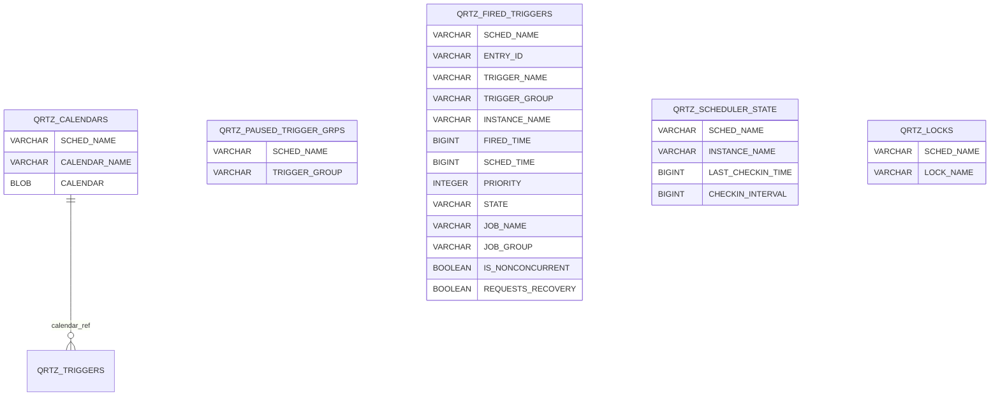

# Quartz 系統狀態與管理

本文件說明 Quartz 系統管理相關資料表：QRTZ_CALENDARS、QRTZ_PAUSED_TRIGGER_GRPS、QRTZ_FIRED_TRIGGERS、QRTZ_SCHEDULER_STATE、QRTZ_LOCKS。

---

## ER 圖

---

## 3.1 QRTZ_CALENDARS
儲存 Quartz 行事曆 (用於排除特定時間，如國定假日)。

| 欄位名稱 | 類型 | 說明 |
| :--- | :--- | :--- |
| `SCHED_NAME` | VARCHAR(120) | **(PK)** 排程器名稱 |
| `CALENDAR_NAME` | VARCHAR(200) | **(PK)** 行事曆名稱 |
| `CALENDAR` | BLOB | 序列化的行事曆物件 |

---

## 3.2 QRTZ_PAUSED_TRIGGER_GRPS
儲存已暫停的觸發器群組。

| 欄位名稱 | 類型 | 說明 |
| :--- | :--- | :--- |
| `SCHED_NAME` | VARCHAR(120) | **(PK)** 排程器名稱 |
| `TRIGGER_GROUP` | VARCHAR(200) | **(PK)** 暫停的群組名稱 |

---

## 3.3 QRTZ_FIRED_TRIGGERS
儲存 **正在執行中** 的觸發器資訊 (執行完畢後通常會刪除)。

| 欄位名稱 | 類型 | 說明 |
| :--- | :--- | :--- |
| `SCHED_NAME` | VARCHAR(120) | **(PK)** 排程器名稱 |
| `ENTRY_ID` | VARCHAR(95) | **(PK)** 執行實例 ID |
| `TRIGGER_NAME` | VARCHAR(200) | 觸發器名稱 |
| `TRIGGER_GROUP` | VARCHAR(200) | 觸發器群組 |
| `INSTANCE_NAME` | VARCHAR(200) | 觸發執行的實例名稱 |
| `FIRED_TIME` | BIGINT | 實際觸發時間 |
| `SCHED_TIME` | BIGINT | 預定觸發時間 |
| `PRIORITY` | INTEGER | 優先級 |
| `STATE` | VARCHAR(16) | 狀態 (`EXECUTING`, `ACQUIRED`, `WAITING`...) |
| `JOB_NAME` | VARCHAR(200) | 任務名稱 |
| `JOB_GROUP` | VARCHAR(200) | 任務群組 |
| `IS_NONCONCURRENT` | BOOLEAN | 是否非並發 |
| `REQUESTS_RECOVERY` | BOOLEAN | 是否要求恢復 |

---

## 3.4 QRTZ_SCHEDULER_STATE
儲存叢集 (Cluster) 中各個 Scheduler 實例的狀態 (用於 Heartbeat)。

| 欄位名稱 | 類型 | 說明 |
| :--- | :--- | :--- |
| `SCHED_NAME` | VARCHAR(120) | **(PK)** 排程器名稱 |
| `INSTANCE_NAME` | VARCHAR(200) | **(PK)** 實例 ID |
| `LAST_CHECKIN_TIME` | BIGINT | 上次 Heartbeat 時間 |
| `CHECKIN_INTERVAL` | BIGINT | Heartbeat 間隔 (ms) |

---

## 3.5 QRTZ_LOCKS
儲存用於叢集環境下的 Pessimistic Locks (悲觀鎖)。

| 欄位名稱 | 類型 | 說明 |
| :--- | :--- | :--- |
| `SCHED_NAME` | VARCHAR(120) | **(PK)** 排程器名稱 |
| `LOCK_NAME` | VARCHAR(40) | **(PK)** 鎖名稱 (如 `TRIGGER_ACCESS`, `JOB_ACCESS`) |

