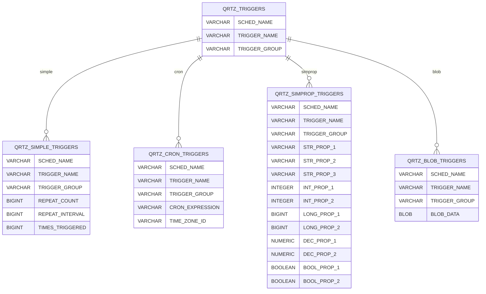

# Quartz 觸發器類型詳細資訊

本文件說明 Quartz 觸發器類型相關資料表：QRTZ_SIMPLE_TRIGGERS、QRTZ_CRON_TRIGGERS、QRTZ_SIMPROP_TRIGGERS、QRTZ_BLOB_TRIGGERS。

---

## ER 圖

---

## 2.1 QRTZ_SIMPLE_TRIGGERS
儲存 **Simple Trigger** (固定間隔/次數) 的詳細設定。

| 欄位名稱 | 類型 | 說明 |
| :--- | :--- | :--- |
| `SCHED_NAME` | VARCHAR(120) | **(PK)** 排程器名稱 |
| `TRIGGER_NAME` | VARCHAR(200) | **(PK)** 觸發器名稱 |
| `TRIGGER_GROUP` | VARCHAR(200) | **(PK)** 觸發器群組 |
| `REPEAT_COUNT` | BIGINT | 重複次數 (-1 為無限) |
| `REPEAT_INTERVAL` | BIGINT | 重複間隔 (ms) |
| `TIMES_TRIGGERED` | BIGINT | 已觸發次數 |

---

## 2.2 QRTZ_CRON_TRIGGERS
儲存 **Cron Trigger** (Cron 表達式) 的詳細設定。

| 欄位名稱 | 類型 | 說明 |
| :--- | :--- | :--- |
| `SCHED_NAME` | VARCHAR(120) | **(PK)** 排程器名稱 |
| `TRIGGER_NAME` | VARCHAR(200) | **(PK)** 觸發器名稱 |
| `TRIGGER_GROUP` | VARCHAR(200) | **(PK)** 觸發器群組 |
| `CRON_EXPRESSION` | VARCHAR(120) | Cron 表達式 |
| `TIME_ZONE_ID` | VARCHAR(80) | 時區 ID |

---

## 2.3 QRTZ_SIMPROP_TRIGGERS
儲存 **Calendar Interval Trigger** 或 **Daily Time Interval Trigger** 屬性。

| 欄位名稱 | 類型 | 說明 |
| :--- | :--- | :--- |
| `SCHED_NAME` | VARCHAR(120) | **(PK)** 排程器名稱 |
| `TRIGGER_NAME` | VARCHAR(200) | **(PK)** 觸發器名稱 |
| `TRIGGER_GROUP` | VARCHAR(200) | **(PK)** 觸發器群組 |
| `STR_PROP_1` | VARCHAR(512) | 字串屬性 1 |
| `STR_PROP_2` | VARCHAR(512) | 字串屬性 2 |
| `STR_PROP_3` | VARCHAR(512) | 字串屬性 3 |
| `INT_PROP_1` | INTEGER | 整數屬性 1 |
| `INT_PROP_2` | INTEGER | 整數屬性 2 |
| `LONG_PROP_1` | BIGINT | 長整數屬性 1 |
| `LONG_PROP_2` | BIGINT | 長整數屬性 2 |
| `DEC_PROP_1` | NUMERIC | 十進位屬性 1 |
| `DEC_PROP_2` | NUMERIC | 十進位屬性 2 |
| `BOOL_PROP_1` | BOOLEAN | 布林屬性 1 |
| `BOOL_PROP_2` | BOOLEAN | 布林屬性 2 |

---

## 2.4 QRTZ_BLOB_TRIGGERS
儲存自訂觸發器類型的序列化資料 (較少用)。

| 欄位名稱 | 類型 | 說明 |
| :--- | :--- | :--- |
| `SCHED_NAME` | VARCHAR(120) | **(PK)** 排程器名稱 |
| `TRIGGER_NAME` | VARCHAR(200) | **(PK)** 觸發器名稱 |
| `TRIGGER_GROUP` | VARCHAR(200) | **(PK)** 觸發器群組 |
| `BLOB_DATA` | BLOB | 自訂觸發器資料 |

