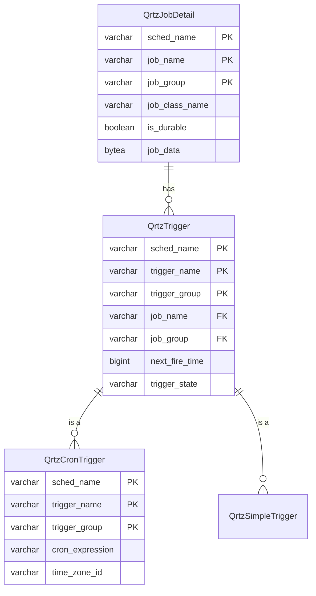

# basic-scheduler 模組設定

## 用途
排程抽象層，透過 Spring `@Profile` 切換本地與雲端實作.

## 架構

```
SchedulerService（介面）
├── QuartzSchedulerService    @Profile("local")     → Spring Quartz
└── CloudSchedulerService     @Profile("cloudrun")  → GCP Cloud Scheduler
```

## API

| 方法 | 說明 |
|------|------|
| `createJob(jobName, cron, payload)` | 建立排程 |
| `deleteJob(jobName)` | 刪除排程 |
| `pauseJob(jobName)` | 暫停排程 |
| `resumeJob(jobName)` | 恢復排程 |

## 本地設定（Quartz）

在 `application-local.yml`：
```yaml
spring:
  quartz:
    job-store-type: memory
    properties:
      org.quartz.threadPool.threadCount: 5
```

## 雲端設定（GCP Scheduler）

在 `application-cloudrun.yml`：
```yaml
gcp:
  project-id: ${GCP_PROJECT_ID}
  location: asia-east1
  scheduler:
    handler-url: ${CLOUD_SCHEDULER_HANDLER_URL}
```

## 如何使用

```java
@Autowired
private SchedulerService schedulerService;


schedulerService.createJob("daily-report", "0 0 8 * * ?", "{\"type\": \"report\"}");
```

## Quartz 資料表結構

若啟用 JDBC JobStore (`local` Profile)，Quartz 會在資料庫中建立以下資料表。

### 實體關係圖 (ER Model)



### JPA Entity 映射

為了方便管理或查詢排程狀態，我們在 `org.inariforge.scheduler.entity.quartz` 套件中建立了對應的 JPA Entity。

*   **唯讀建議**：這些 Entity 被標註為 `@Immutable`，建議僅用於查詢，避免透過 JPA 修改 Quartz 內部狀態，以免破壞排程器的資料一致性。
*   **主要 Entity**：我們已為所有 11 張 Quartz 標準資料表建立對應的 JPA Entity。
    *   `QrtzJobDetail`: 對應 `qrtz_job_details`
    *   `QrtzTrigger`: 對應 `qrtz_triggers`
    *   ... (完整列表請見下方連結)

詳細的資料表欄位說明與 Entity 對照，請參考獨立文件：
👉 [Quartz 資料表欄位說明](../FRAMEWORK/QUARTZ_TABLES.md)

